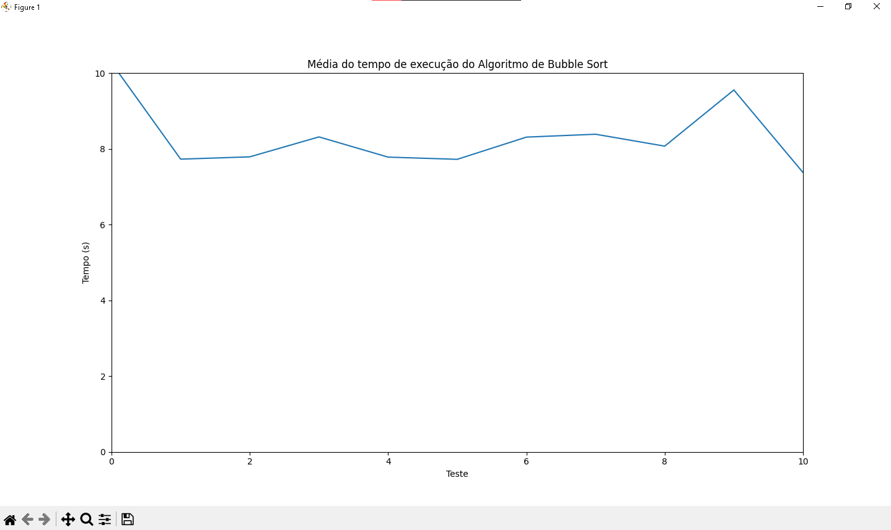
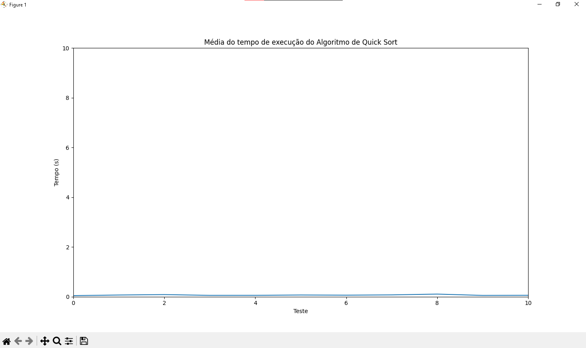

<a href="https://www.fiap.com.br/">

</a> <br>

<a href="https://www.instagram.com/fiapoficial/">

</a>
<a href="https://www.youtube.com/@FiapBrasil">

</a>

# Sorting-Algorithms

## Checkpoint 12/05/2023

<br>

### Objetivo:

<br>

O grupo deverá escolher 3 algoritmos de ordenação e testá-los, escolhendo o mais rápido, implementá-los e medir o tempo gasto para realizar a ordenação de uma lista de senhas.

- Editor Utilizado: <a href="https://code.visualstudio.com/"> Visual Studio Code</a>.

- Video Explicativo: <a href="https://youtu.be/aHCxAWcjTp0/"> link </a>.


- <a href="https://"> Slides
  </a><br>

# Algoritmos de Ordenação escolhidos

## Algoritmo de Bubble Sort

Bubble Sort é um algoritmo de classificação (ou ordenação) simples que funciona comparando pares de elementos adjacentes em uma lista e trocando suas posições se estiverem na ordem errada. O algoritmo percorre a lista várias vezes, comparando e trocando os elementos adjacentes até que a lista esteja completamente ordenada.

O Bubble Sort é um dos algoritmos de classificação mais simples e intuitivos, mas também é um dos menos eficientes. Sua complexidade de tempo é O(n^2), o que significa que o tempo de execução do algoritmo aumenta exponencialmente com o tamanho da lista a ser classificada.

O processo de ordenação do Bubble Sort pode ser visualizado como "borbulhar" os elementos maiores para o final da lista, à medida que eles são comparados e trocados com os elementos adjacentes menores. A implementação do Bubble Sort é relativamente fácil, mas é mais adequada para listas pequenas ou já quase ordenadas, pois sua eficiência diminui drasticamente com o aumento do tamanho da lista.

## Algoritmo de Quick Sort

Quick Sort é um algoritmo de ordenação que utiliza a abordagem "divide and conquer" (dividir e conquistar) para ordenar uma lista de elementos. A ideia básica do Quick Sort é selecionar um elemento como pivô e rearranjar os outros elementos em relação a ele, de forma que os elementos menores que o pivô fiquem à esquerda e os elementos maiores à direita. Em seguida, o algoritmo é recursivamente aplicado para a sublista à esquerda e à direita do pivô, até que a lista completa esteja ordenada.

A escolha do pivô é uma parte importante do algoritmo, pois pode afetar significativamente a eficiência do Quick Sort. Idealmente, o pivô deve ser escolhido de forma a dividir a lista em duas partes iguais, mas isso nem sempre é possível. Uma das estratégias mais comuns é selecionar o elemento do meio como pivô, mas outras estratégias, como a seleção aleatória do pivô, também são utilizadas.

A complexidade de tempo do Quick Sort é O(n log n) em média, mas pode chegar a O(n^2) no pior caso, quando a escolha do pivô é feita de forma inadequada e a lista já está quase ordenada. No entanto, em geral, o Quick Sort é um algoritmo de ordenação muito eficiente e é amplamente utilizado em aplicações que envolvem grandes quantidades de dados a serem ordenados, como processamento de banco de dados e ordenação de arquivos.

O Quick Sort é um algoritmo in-place, o que significa que ele pode ser implementado de forma que a ordenação seja feita diretamente na lista de entrada, sem a necessidade de armazenar dados adicionais na memória. Isso o torna uma opção atraente em sistemas com recursos limitados de memória.

## Algoritmo de Merge Sort

Merge Sort é um algoritmo de ordenação que utiliza a abordagem "divide and conquer" (dividir e conquistar). A ideia básica do Merge Sort é dividir a lista de elementos a serem ordenados em duas metades menores, ordenar cada metade de forma recursiva e, em seguida, combinar as duas metades ordenadas em uma única lista ordenada.

O processo de divisão é repetido até que cada sublista contenha apenas um elemento, o que, por definição, já está ordenado. Em seguida, as sublistas são mescladas em pares, ordenando-as simultaneamente, até que a lista completa seja reconstruída.

A complexidade de tempo do Merge Sort é O(n log n), o que o torna um algoritmo de ordenação muito eficiente em comparação com outros algoritmos de complexidade quadrática, como o Bubble Sort. Além disso, o Merge Sort é estável, ou seja, a ordem relativa dos elementos com chaves iguais é mantida após a ordenação.

O Merge Sort é amplamente utilizado em aplicações que envolvem grandes quantidades de dados a serem ordenados, como processamento de banco de dados e ordenação de arquivos. Sua principal desvantagem é que requer espaço adicional na memória para armazenar as sub-listas durante o processo de ordenação, o que pode torná-lo menos eficiente em sistemas com recursos limitados de memória.

# Explicação dos códigos

## Código do Bubble Sort

### Função Bubble Sort - functions.py

```
def bubble_sort(lista):
    n = len(lista)
    for i in range(n):
        for j in range(0, n-i-1):
            if lista[j] > lista[j+1]:
                lista[j], lista[j+1] = lista[j+1],
                lista[j]
    return lista
```

O código apresenta uma implementação do algoritmo de ordenação Bubble Sort em Python.

A função <span style="color: yellow;"> **_bubble_sort_** </span> recebe uma lista de elementos como argumento e retorna a lista ordenada em ordem crescente. A lógica do algoritmo é simples: percorrer a lista várias vezes, comparando e trocando os elementos adjacentes até que a lista esteja completamente ordenada.

O primeiro passo do algoritmo é obter o comprimento da lista, que é armazenado na variável <span style="color: #123889;"> **_n_** </span>. Em seguida, o algoritmo percorre a lista utilizando dois loops <span style="color: #d40f47;"> **_for_** </span>. O loop externo (<span style="color: #d40f47;">**_for </span> i <span style="color: #d40f47;"> in </span> <span style="color: #00a624;"> range</span>(<span style="color: #123889;">n</span>)_**) é responsável por percorrer a lista n vezes, garantindo que todos os elementos sejam comparados e trocados, se necessário.

O loop interno (<span style="color: #d40f47;">**_for</span> j <span style="color: #d40f47;">in</span> <span style="color: #00a624;">range</span>(<span style="color: #9900b8;">0</span>, n-i-<span style="color: #9900b8;">1</span>)_**) percorre a lista a cada iteração do loop externo, comparando os elementos adjacentes e trocando-os, se necessário. O índice <span style="color: orange;">**_j_**</span> varia de 0 a **_n-i-<span style="color: #9900b8;">1_**</span>, garantindo que apenas os elementos ainda não ordenados sejam comparados.

A condição <span style="color: #d40f47;">**_if</span> lista[<span style="color: orange;">j</span>] > lista[<span style="color: orange;">j+1</span>]_** verifica se o elemento atual (**_lista[<span style="color: orange;">j</span>]_**) é maior que o próximo elemento (**_lista[<span style="color: orange;">j+1</span>]_**). Se a condição for verdadeira, os elementos são trocados utilizando a sintaxe **_lista[<span style="color: orange;">j</span>], lista[<span style="color: orange;">j+1</span>] = lista[<span style="color: orange;">j+1</span>], lista[<span style="color: orange;">j</span>]_**.

Ao final das iterações, a lista estará ordenada e é retornada pela função. A complexidade de tempo do Bubble Sort é O(n^2), onde **_n_** é o número de elementos na lista, o que pode tornar este algoritmo menos eficiente em comparação com outros algoritmos de ordenação, como o Merge Sort e o Quick Sort, para listas maiores.

### Script Bubble Sort - script.py

```
from functions import bubble_sort
import time
import matplotlib.pyplot

with open("wordlists/probable-v2-top12000.txt", "r") as arquivo:
    lista = arquivo.read().splitlines()
result = []
cont = 0
total = 0
while cont < 15:
    start_time = time.time()
    ordenada = bubble_sort(lista)
    end_time = time.time()
    total_time = end_time - start_time
    result.append(float(total_time))
    print("\033[30m--------------------------------------------------------")
    print("\033[34m", ordenada)
    print("\033[30m--------------------------------------------------------")
    print("\033[32mTempo de execução: {:.5f} segundos".format(total_time))
    print("\033[30m--------------------------------------------------------")
    print("\033[36mTamanho da wordlist: {} palavras".format(len(lista)))
    cont += 1
media = sum(result) / len(result)
print("\033[30m--------------------------------------------------------")
print("\033[33mTestes realizados:", result)
print("\033[30m--------------------------------------------------------")
print("\033[35mMédia de tempo: {}".format(media))
print("\033[30m--------------------------------------------------------")
matplotlib.pyplot.title(
    'Média do tempo de execução do Algoritmo de Bubble Sort')
matplotlib.pyplot.xlabel('Teste')
matplotlib.pyplot.ylabel('Tempo (s)')
matplotlib.pyplot.plot(result)
matplotlib.pyplot.ylim(0, 10)
matplotlib.pyplot.xlim(0, 10)
matplotlib.pyplot.show()
```

Este código realiza o teste de desempenho do algoritmo Bubble Sort em uma lista de palavras obtida de um arquivo.

O código começa importando a função <span style="color: yellow">**_bubble_sort_**</span> de um módulo chamado "functions" e também importa os módulos <span style="color: yellow">**_time_**</span> e <span style="color: yellow">**_matplotlib.pyplot._**</span> Em seguida, o código abre o arquivo <span style="color: #d40f47;">**"probable-v2-top12000.txt"**</span> que contém uma lista de palavras em ordem aleatória. O método <span style="color: #00a624;">**_read()_**</span> é usado para ler todo o conteúdo do arquivo e o método <span style="color: #00a624;">**_splitlines()_**</span> é usado para separar as linhas em uma lista de palavras.

A partir disso, o código entra em um loop while que é executado 15 vezes. A cada iteração, o algoritmo Bubble Sort é executado na lista de palavras e o tempo de execução é medido usando a função <span style="color: #00a624;">**_time.time()_**</span>. O tempo de execução é armazenado em uma lista <span style="color: orange;">**_result_**</span>.

Além disso, durante cada iteração, o código imprime a lista ordenada, o tempo de execução e o tamanho da lista de palavras. A cor do texto é definida usando códigos ANSI de escape. Isso é feito usando a sintaxe <span style="color: #123889;">**_\033[CORm_**</span>, onde "COR" é o código da cor e "m" é o código de fim de sequência. Por exemplo, <span style="color: #123889;">**_\033[32m_**</span> define a cor do texto para verde.

Após as 15 iterações, o código calcula a média dos tempos de execução e imprime os resultados. Em seguida, o código usa a biblioteca <span style="color: #00a624;">**_matplotlib.pyplot_**</span> para criar um gráfico da média dos tempos de execução. O gráfico mostra o tempo de execução em segundos no eixo Y e o número do teste no eixo X. A biblioteca <span style="color: #00a624;">**_matplotlib.pyplot_**</span> é usada para configurar as propriedades do gráfico e exibi-lo na tela.

### Gráfico da média do tempo de execução do algoritmo

<br>

## Código do Quick Sort

### Função Quick Sort - functions.py

```
def quick_sort(lista):
    if len(lista) <= 1:
        return lista
    else:
        pivo = lista[0]
        menores = [x for x in lista[1:] if x < pivo]
        maiores = [x for x in lista[1:] if x >= pivo]
        return quick_sort(menores) + [pivo] +
        quick_sort(maiores)
```

A função <span style="color: #00a624;">**_quick_sort</span>(<span style="color: orange;">lista</span>)_** implementa o algoritmo de ordenação rápida (Quick Sort) em Python. Esse algoritmo é conhecido por ser eficiente para grandes conjuntos de dados, tendo uma complexidade média de tempo de O(n log n).

O algoritmo funciona dividindo repetidamente a lista em duas sub-listas menores: uma contendo elementos menores do que um elemento de referência (pivô) e outra contendo elementos maiores ou iguais ao pivô. Em seguida, ele ordena recursivamente essas duas sub-listas e as concatena em uma lista ordenada.

O código começa verificando se a <span style="color: orange;">**_lista_**</span> de entrada lista contém apenas um elemento ou nenhum elemento, o que significa que já está ordenada. Se for esse o caso, a lista é simplesmente retornada. Caso contrário, a função seleciona o primeiro elemento da lista como pivô e cria duas sub-listas, <span style="color: #346888;">**_menores_**</span> e <span style="color: #346888;">**_maiores_**</span>, que contêm todos os elementos menores e maiores ou iguais ao pivô, respectivamente.

Em seguida, a função chama recursivamente <span style="color: #00a624;">**_quick_sort_**</span> nas sub-listas <span style="color: #346888;">**_menores_**</span> e <span style="color: #346888;">**_maiores_**</span> e concatena o resultado da ordenação das sub-listas com o pivô no meio para formar a lista final ordenada.

No geral, a função <span style="color: #00a624;">**_quick_sort</span>(<span style="color: orange;">lista</span>)_** é uma implementação eficiente do algoritmo de ordenação rápida em Python, que permite ordenar uma lista de elementos em tempo O(n log n).

### Script Quick Sort - script.py

```
from functions import quick_sort
import time
import matplotlib.pyplot

with open("wordlists/probable-v2-top12000.txt", "r") as arquivo:
    lista = arquivo.read().splitlines()
result = []
cont = 0
total = 0
while cont < 15:
    start_time = time.time()
    ordenada = quick_sort(lista)
    end_time = time.time()
    total_time = end_time - start_time
    result.append(float(total_time))
    print("\033[30m--------------------------------------------------------")
    print("\033[34m", ordenada)
    print("\033[30m--------------------------------------------------------")
    print("\033[32mTempo de execução: {:.5f} segundos".format(total_time))
    print("\033[30m--------------------------------------------------------")
    print("\033[36mTamanho da wordlist: {} palavras".format(len(lista)))
    cont += 1
media = sum(result) / len(result)
print("\033[30m--------------------------------------------------------")
print("\033[33mTestes realizados:", result)
print("\033[30m--------------------------------------------------------")
print("\033[35mMédia de tempo: {}".format(media))
print("\033[30m--------------------------------------------------------")
matplotlib.pyplot.title(
    'Média do tempo de execução do Algoritmo de Quick Sort')
matplotlib.pyplot.xlabel('Teste')
matplotlib.pyplot.ylabel('Tempo (s)')
matplotlib.pyplot.plot(result)
matplotlib.pyplot.ylim(0, 10)
matplotlib.pyplot.xlim(0, 10)
matplotlib.pyplot.show()
```

O código começa importando a função **_quick_sort_** de um módulo chamado "functions", que provavelmente contém implementações de algoritmos de ordenação. Em seguida, ele importa os módulos **_time_** e **_matplotlib.pyplot_**.

Depois disso, o código abre um arquivo chamado "probable-v2-top12000.txt" que contém uma lista de palavras, lê o conteúdo do arquivo e o divide em uma lista de palavras usando o método **_splitlines()_**. A lista resultante é atribuída à variável **_lista_**.

Em seguida, o código inicia um loop **_while_** que executa 15 vezes. Dentro do loop, o código mede o tempo que leva para ordenar a lista usando a função quick_sort e armazena o tempo de execução em uma lista chamada **_result_**. O código também imprime a lista ordenada, o tempo de execução e o tamanho da lista.

Após o loop terminar, o código calcula a média do tempo de execução dos testes realizados e imprime os resultados.

Por fim, o código usa a biblioteca **_matplotlib.pyplot_** para gerar um gráfico da média do tempo de execução do algoritmo de ordenação rápida para os testes realizados. O gráfico mostra o tempo de execução em segundos no eixo Y e o número de testes no eixo X. O código define o título do gráfico, os rótulos dos eixos e os limites dos eixos. Em seguida, ele plota os resultados usando o método **_plot()_** e mostra o gráfico usando o método **_show()_**.

### Gráfico da média do tempo de execução do algoritmo

<br>

## Código do Merge Sort (o algoritmo escolhido)

### Função Quick Sort - functions.py

```
def merge_sort(lista):
    if len(lista) <= 1:
        return lista
    meio = len(lista) // 2
    esquerda = lista[:meio]
    direita = lista[meio:]
    esquerda = merge_sort(esquerda)
    direita = merge_sort(direita)
    return merge(esquerda, direita)


def merge(esquerda, direita):
    resultado = []
    i, j = 0, 0
    while i < len(esquerda) and j < len(direita):
        if esquerda[i] < direita[j]:
            resultado.append(esquerda[i])
            i += 1
        else:
            resultado.append(direita[j])
            j += 1
    resultado += esquerda[i:]
    resultado += direita[j:]
    return resultado
```

Este é um código Python que implementa o algoritmo de ordenação merge sort. A função merge_sort recebe uma lista como entrada e retorna a lista ordenada. A primeira verificação na função é se a lista tem tamanho menor ou igual a 1, caso sim, a lista já está ordenada e é retornada.

Caso contrário, a lista é dividida em duas partes iguais, esquerda e direita, utilizando o operador de fatiamento do Python. Em seguida, as funções merge_sort são chamadas recursivamente em cada metade da lista, e o resultado é armazenado nas variáveis esquerda e direita.

Por fim, a função merge é chamada com as duas listas ordenadas e retorna uma única lista ordenada. A função merge cria uma lista vazia chamada resultado e duas variáveis para percorrer as listas esquerda e direita, respectivamente.

Enquanto ainda houver elementos nas duas listas, a função compara o primeiro elemento de cada lista e adiciona o menor elemento à lista resultado. Quando uma das listas estiver completamente percorrida, a função adiciona todos os elementos restantes da outra lista à lista resultado.

Ao final, a lista resultado é retornada como a lista ordenada completa.

### Script Quick Sort - script.py

```
from functions import merge_sort
import time
import matplotlib.pyplot

with open("wordlists/probable-v2-top12000.txt", "r") as arquivo:
    lista = arquivo.read().splitlines()
result = []
cont = 0
total = 0
while cont < 15:
    start_time = time.time()
    ordenada = merge_sort(lista)
    end_time = time.time()
    total_time = end_time - start_time
    result.append(float(total_time))
    print("\033[30m--------------------------------------------------------")
    print("\033[34m", ordenada)
    print("\033[30m--------------------------------------------------------")
    print("\033[32mTempo de execução: {:.5f} segundos".format(total_time))
    print("\033[30m--------------------------------------------------------")
    print("\033[36mTamanho da wordlist: {} palavras".format(len(lista)))
    cont += 1
media = sum(result) / len(result)
print("\033[30m--------------------------------------------------------")
print("\033[33mTestes realizados:", result)
print("\033[30m--------------------------------------------------------")
print("\033[35mMédia de tempo: {}".format(media))
print("\033[30m--------------------------------------------------------")
matplotlib.pyplot.title(
    'Média do tempo de execução do Algoritmo de Merge Sort')
matplotlib.pyplot.xlabel('Teste')
matplotlib.pyplot.ylabel('Tempo (s)')
matplotlib.pyplot.plot(result)
matplotlib.pyplot.ylim(0, 10)
matplotlib.pyplot.xlim(0, 10)
matplotlib.pyplot.show()
```

Esse código em Python realiza testes de desempenho da função **_merge_sort_** (implementada em um arquivo **_functions.py_**) em uma lista de palavras obtida a partir de um arquivo **_probable-v2-top12000.txt_**.

O código começa importando as bibliotecas necessárias: **_time_**, para medir o tempo de execução da função, e **_matplotlib.pyplot_** para gerar um gráfico dos resultados.

Em seguida, a lista de palavras é carregada a partir do arquivo usando o método **_read().splitlines()_** para separar as palavras por linha. A variável **_result_** é inicializada como uma lista vazia para armazenar os resultados de tempo de execução.

O código entra em um loop **_while_** que executa a ordenação com **_merge_sort_** na lista carregada do arquivo, calcula o tempo de execução e armazena o tempo na lista **_result_**. Esse loop é executado 15 vezes, para obter uma média mais precisa do tempo de execução.

Em seguida, o código calcula a média dos tempos de execução a partir da lista **_result_**. O resultado é impresso no console, bem como o tempo médio de execução e um gráfico com os tempos de execução para cada teste.

Finalmente, a biblioteca **_matplotlib.pyplot_** é usada para gerar um gráfico com os resultados dos testes, onde o eixo x representa os testes realizados e o eixo y representa o tempo de execução em segundos. O gráfico mostra a tendência do tempo de execução da função **_merge_sort_** à medida que o tamanho da lista aumenta. O **ylim** e o **xlim** definem o intervalo dos eixos.

### Gráfico da média do tempo de execução do algoritmo

<br>

# Colaboradores

<a href="https://github.com/Aykie"> Júlia Barboza Brunelli</a>, <a href="https://github.com/NCalegariS"> Nicholas Calegari</a> e <a href="https://github.com/WHrez1ns"> Renan Dias</a>
<br>
**RM: 98558, 93912 e 99258.**
